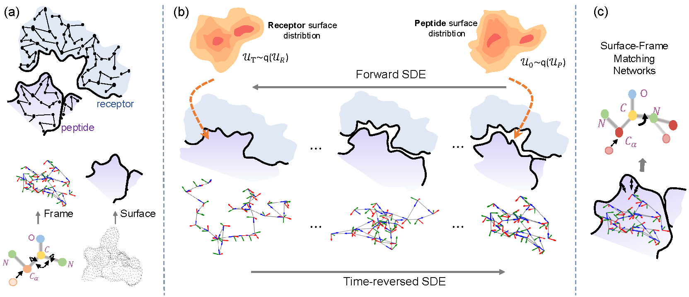

# PepBridge: Joint Design of Protein Surface and Backbone Using a Diffusion Bridge Model



## Overview

PepBridge implements joint design of protein surface and backbone using a diffusion bridge model (NeurIPS 2025).

**PepBridge** is a novel framework for the joint design of protein surface and backbone structures. It leverages receptor surface geometry and biochemical properties to generate ligand structures that are both conformationally stable and chemically feasible. Starting from a receptor surface represented as a 3D point cloud, PepBridge employs a **Denoising Diffusion Bridge Model (DDBM)** to generate complementary ligand surfaces. A multi-modal diffusion model then predicts the corresponding backbone structures, while **Shape-Frame Matching Networks** ensure alignment between the surface geometry and the predicted backbone architecture. This integrated approach promotes both surface complementarity and structural plausibility in the design of peptide–receptor complexes.

## Installation

We recommend using conda. From this folder (`Pepbridge/`):

```bash
conda env create -f environment.yml
conda activate pepbridge

# Optional: install extra wheels if needed for your CUDA/PyTorch

pip install torch-scatter -f https://data.pyg.org/whl/torch-2.0.0+cu117.html

pip install joblib lmdb easydict wandb
```

## Dataset

### Sources
- PepBDB: http://huanglab.phys.hust.edu.cn/pepbdb/db/1cta_A/
- QBioLip: https://yanglab.qd.sdu.edu.cn/Q-BioLiP/Download

### Layout after preprocessing

```text
PepMerge/
├── 1a0n_A/
│   ├── peptide.pdb
│   ├── receptor.pdb
│   ├── pocket.pdb
│   ├── surface_1a0n_A_peptide.pdb.obj
│   └── surface_1a0n_A_pocket.pdb.obj
├── 1a1a_C/
└── ...
Process_Data/
├── names.txt
├── pep_pocket_train_surf_structure_cache.lmdb
└── pep_pocket_test_surf_structure_cache.lmdb
```

Use `models_con/pep_dataloader.py` to prepare inputs for training.
Processed datasets and pretrained model weights are available here: [link](https://drive.google.com/file/d/1VaNRppGnCG6AdmZ7i8KsmMbZPJrIx-yg/view?usp=sharing).

## Training

From this folder (`Pepbridge/`):

```bash
python train_pepbridge.py
```

From repo root:

```bash
python Pepbridge/train_pepbridge.py
```

Configuration lives in `configs/learn_surf_angle.yaml` (edit to change training settings).

## Inference & Generation

Generate peptide structures from trained checkpoints:

1) Sample candidates

```bash
python inference_pepbridge.py
```

2) Reconstruct full PDBs from samples

```bash
python reconstruct.py
```

## Acknowledgements

We appreciate the inspiration from [DDBM](https://github.com/alexzhou907/DDBM), [DiffAb](https://github.com/luost26/diffab), and [PepFlow](https://github.com/Ced3-han/PepFlowww).
